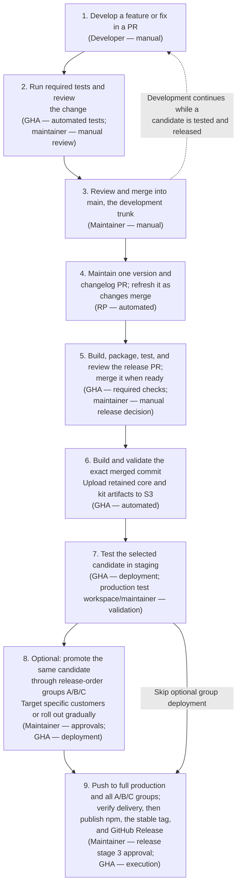
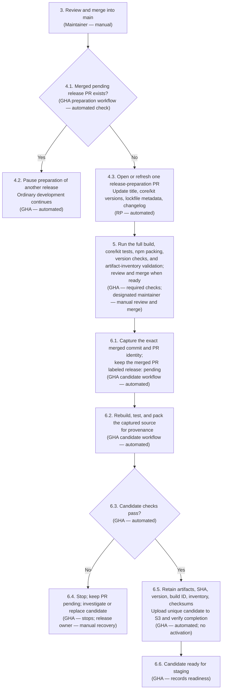
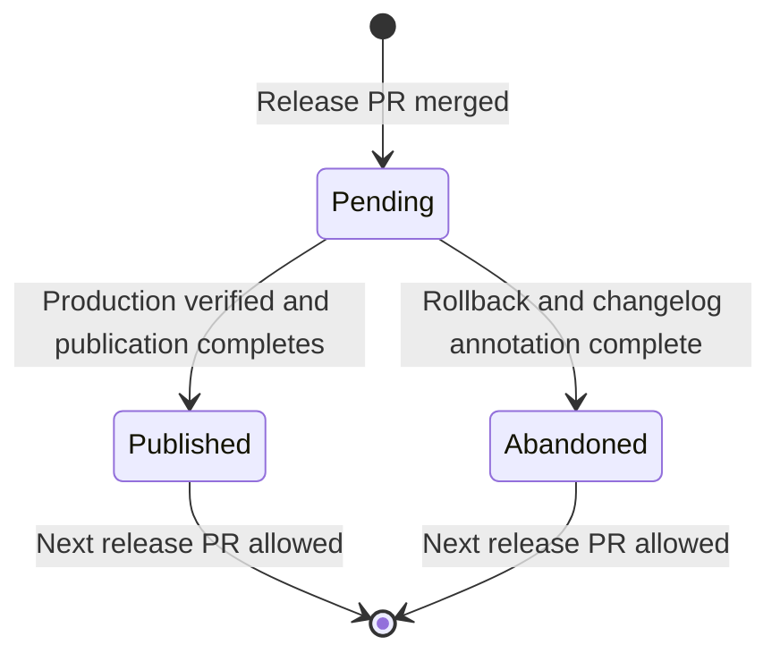

# V3 trunk development and S3 release delivery

Updated 2026-09-17. This describes the proposed process, not deployed behavior.

Our goal is to align mParticle's development and release process with Rokt's as
much as practical, reducing the cognitive load of working across the two SDKs.
Developers should have a familiar way to merge changes, prepare a build, test it,
and promote it to production. We will keep GitHub Actions and account for
mParticle's public repository, semantic versions, and npm packages while adopting
the shared practices of trunk development and promoting a specific tested build.

This work focuses on using `main` as the development trunk and changing how
mPServer pulls and caches the mParticle v3 core and kit distribution files. Instead
of following the distribution files on `main`, mPServer will load a selected build
from S3 and cache it for delivery, independently of ongoing development.

## Why we are changing the development and release process

The main complication with making `main` our development trunk is that mPServer
currently pulls the v3 distribution files from that same branch—for example,
[`main/dist/mparticle.js`](https://github.com/mParticle/mparticle-web-sdk/blob/main/dist/mparticle.js). This couples
development history to production delivery: release builds add generated-file
commits, and changes to those distribution files can reach customers. Letting
development continue while a release is tested therefore requires coordinating
release commits and branch freezes. We want to separate those responsibilities
so merging code into `main` does not change the version served to customers.

## The proposed approach

We will merge features and fixes into `main` continuously. We will use the
Google-supported open-source GitHub Action
[Release Please](https://github.com/googleapis/release-please-action) (RP) to
automatically create and maintain a release PR containing the changelog and
version bumps for core and kits. As more changes merge into `main`, that same release PR is updated.
When we decide it is ready, we review and merge it. A GitHub Actions workflow then
builds the distribution files from that exact commit and uploads them to S3,
instead of committing them to `main`. Staging, rollout groups, and production
select the approved build through a small `active-release.json` file for each channel.
Developers can keep merging into `main` while the captured build is tested and
released, because those later merges do not change its artifacts.

The S3 delivery change covers unpinned v3 core with kits. V2, `stub.js`, and
distribution files referenced by tagged versions keep their existing delivery
paths; the compatibility requirements for those files are called out below.

## 1. Development process overview

Steps **1–9** describe the overall process. Detailed diagrams reuse those numbers
with substeps such as **4.1** and **6.2**. **R1** is deployment recovery. The existing release-workflow stages
are called **release stage 1/2/3** below to distinguish them from diagram steps.



This is the intended everyday process after the migration. Version and changelog
changes are committed to `main` (5); distribution files are built and stored in S3
(6).
Promotion changes which retained build mPServer serves, independently of new
source merges (7–9). The following diagrams expand preparation and deployment gates;
the incremental implementation plan appears later.

## 2. Target: one updating release PR, then one captured candidate

This expands overview Steps **3–6**. PR creation, tests, and initial review are
Steps **1–2** in the overview above and are not repeated here. Developers continue
that loop while the captured candidate is tested and released.



-   Example title: `chore: prepare 3.4.1 release`, updated to
    `chore: prepare 3.5.0 release` if a feature changes the proposed version (4.3).
-   Calculate from the published baseline, not the prior unmerged proposal (4.3).
-   Version/changelog commits belong on `main` (5); generated distribution artifacts
    do not (6.5). Preserve compatible dependency ranges unless a separate compatibility
    change requires updating them; do not require unpublished npm dependencies (4.3).
-   Initially rerun required tests on the captured source for simplicity (6.2). This
    avoids designing CI-result reuse now. Never build a later moving `main` head (6.1).
-   The release PR remains open and RP refreshes it as features and fixes merge into
    `main`. Before merging it, the release owner confirms that RP has incorporated
    all changes currently on `main` and that the required checks pass. Merging the
    release PR establishes the candidate boundary. Changes merged afterward belong
    to the next release and may continue while the captured candidate is tested and
    deployed. Initially, the release owner coordinates this boundary; a merge queue
    or automated freshness check may enforce it later.
-   Required release-PR checks must also verify that every publishable package is
    covered by RP's explicit version-update configuration. This prevents a newly
    added package from silently retaining an older version.
-   Reconcile preparation after the release is published or abandoned, including
    feature merges that arrived during testing. PR updates rerun required checks and
    require review of their current contents. A separate freeze label is unnecessary.

## 3. Target: activate the same S3 candidate through each channel

```mermaid
flowchart TD
    A["7.1. Verified candidate in required existing regional buckets<br/>(GHA — uploads and verifies identical copies)"] --> B["7.2. Wait for exclusive deployment access;<br/>verify the pending release PR and candidate<br/>(GHA — automated)"]
    B --> D["7.3. Save previous active-release.json contents; update staging/active-release.json<br/>(GHA — automated)"]
    D --> E["7.4. Load selected core/kit set and allow cache refresh to propagate<br/>Retain prior cache on load failure<br/>(mPServer and existing cache process — automated)"]
    E --> F{"7.5. Tests pass in Web Team Test after confirming the candidate is being served?<br/>(Production test workspace/maintainer — manual; GHA — configured checks)<br/>Future: automated end-to-end tests verify delivery and behavior"}
    F -- No --> R["R1. Stop; keep PR pending; recover or replace candidate<br/>(Maintainer — initiates recovery; GHA — executes)"]
    F -- Yes --> OPTIONAL{"8.0. Use release-order groups A/B/C first?<br/>Target specific customers or roll out gradually<br/>(Maintainer — manual choice; group deployment is optional)"}
    OPTIONAL -- Yes --> G["8.1. Approve next release-order group A/B/C - release stage 2<br/>Target specific customers or roll out gradually<br/>(stand-in for future canary release/rollback)<br/>(Maintainer — manual)"]
    OPTIONAL -- "No - skip group deployment" --> K
    G --> H["8.2. Record prior values; update group active-release.json files in regional buckets<br/>(GHA — automated; mPServer — consumes candidate)"]
    H --> I{"8.3. Group health and propagation verified?<br/>(Maintainer — observation; GHA — configured checks)"}
    I -- No --> R
    I -- Yes --> J{"8.4. More release-order groups A/B/C remain?<br/>(GHA — automated)"}
    J -- Yes --> G
    J -- No --> K["9.1. Approve final production push and publication - release stage 3<br/>(Authorized maintainer — manual approval)"]
    K --> L["9.2. Promote the candidate to full production
    and all release-order groups A/B/C<br/>(GHA — automated conditional updates)"]
    L --> M{"9.3. Expected build served and basic health verified
    in every required region?<br/>(GHA — checks; maintainer — observation)"}
    M -- No --> R
    M -- Yes --> O["9.4. Publish retained npm packages; create the stable tag;
    create the GitHub Release with notes since the last published v3 tag<br/>Continue release stage 3 without another release trigger<br/>(GHA — automated)"]
    O --> P{"9.5. Publication complete?<br/>(GHA — automated verification)"}
    P -- No --> Q["9.6. Record partial completion; retry missing steps with same artifacts<br/>(Maintainer — manual retry; GHA — verifies and executes)"]
    Q --> P
    P -- Yes --> V{"9.7. Extended production observation remains healthy?<br/>(GHA — checks; maintainer — observation)"}
    V -- No --> R
    V -- Yes --> S["9.8. Finalize release PR label and run record; release lock<br/>Reconcile next preparation PR<br/>(GHA — automated)"]
```



Staging activation has no separate manual selection or approval gate (7.3). After
GHA updates `staging/active-release.json` (7.3) and the cache refresh/bust propagates (7.4),
the Web Team Test workspace is assigned to `staging` in the release-order database
entry, so mPServer serves the staging build to that workspace. Confirm the expected
build is being served before assessing test results (7.5). Approval to advance
follows staging testing (8.1 or 9.1).

**Release order:**

-   **Staging (7):** Deploy and test the candidate.
-   **Optional customer groups (8):** Deploy to A/B/C groups to target specific
    customers or roll out gradually.
-   **Full production and publication (9):** Deploy to full production and all
    A/B/C groups, verify the expected build and basic health in every required
    region, then publish the npm packages, stable tag, and GitHub Release. These
    actions run in the same workflow stage, with no separate publication trigger.

The production push and publication are not atomic. Record progress and resume
incomplete operations with the retained artifacts rather than rebuilding. Basic
regional delivery and health must pass before npm publication; extended
observation continues afterward. A later CDN rollback cannot undo published npm
packages.

The publication workflow resolves the most recent published, non-draft v3 release,
validates that its stable tag is an ancestor of the candidate, and passes that tag
explicitly as the start of generated GitHub Release notes. This is necessary in a
repository that also contains v2 tags. If a candidate version was abandoned and
never tagged, the successor's release notes therefore cover all changes since the
last version customers could install.

After staging passes, the maintainer can skip Step 8 and proceed directly to
Step 9. Step 9 always promotes the same candidate to full production and all
release-order groups A/B/C, whether or not group deployment was used (9.2). Staging
has its own `active-release.json` (7.3).

Web Team Test validates the selected artifact and application behavior through one
US2 production workspace; a successful staging test does not prove regional
distribution. Regional upload, serving, and propagation are verified separately.
When A/B/C groups are used for gradual rollout, the release plan defines the
health signals, failure thresholds, and minimum observation period before the next
group. A/B/C may also be used for specific customer targeting without representing
a percentage-based canary.

Any failed upload/deployment operation, cancellation, or rejected approval stops
progress even if not explicitly drawn as a decision diamond (6.4, R1, 9.6). No next
group is activated before the previous group's validation (8.3–8.4). S3
read-after-write consistency does not mean mPServer instances and CDN caches have
finished propagating (7.4–7.5, 8.3, 9.7).

## S3 layout: keep staging and v3-production names

Proposed new prefix, separate from existing `[jsfiles]/` backups: candidate
artifacts (6.5) and `active-release.json` files for staging (7.3), rollout groups (8.2),
and production plus rollout groups (9.2).

```text
[jsfiles]/v3-releases/
  candidates/<version>/<build-id>/
    cdn-bundles.tgz
    metadata.json
    core/...                    # unpinned v3 conkits source
    kits/...                    # optional expansion for future mPServer loading
    npm/...                     # retained npm packages
  staging/active-release.json
  rollout-a/active-release.json
  rollout-b/active-release.json
  rollout-c/active-release.json
  v3-production/active-release.json
```

Each candidate has its own S3 location (6.5). Uploading its files does not activate
it; updating a channel’s `active-release.json` selects that build for delivery
(7.3, 8.2, 9.2). For example, `[jsfiles]/v3-releases/staging/active-release.json` could contain this
example JSON (7.3):

```json
{
    "version": "3.5.0",
    "candidatePrefix": "[jsfiles]/v3-releases/candidates/3.5.0/12345-1/",
    "metadataSha256": "<verified SHA-256 of completed candidate metadata>"
}
```

-   `version`: the selected SDK version, shared by core and kits.
-   `candidatePrefix`: where that build's files live in the same regional bucket.
    Here, `12345-1` represents GitHub Actions run ID `12345`, attempt `1` (6.5).
-   `metadataSha256`: the checksum of `metadata.json` inside that candidate prefix.
    The value above is a placeholder; GHA writes the actual checksum. The metadata
    records the source SHA, build identity, and artifact inventory/checksums (6.5).

mPServer reads this `active-release.json`, verifies the metadata and required files, then
loads the selected core/kit set (7.4). Each channel has its own `active-release.json`:
staging can select `3.5.0` while production still selects an earlier build.
Promotion updates the destination's `active-release.json` to point to the tested candidate
(8.2, 9.2); rollback selects a previous validated candidate (R1).

Each region must be bootstrapped with a verified last-known-good candidate before
cutover. If the selected candidate cannot be loaded, an existing instance continues
serving that known-good build and a new instance loads the persisted known-good
selection. If neither is available, the instance fails readiness instead of
serving an incomplete core/kit set.

**Recommendation:** GHA updates the `active-release.json` file rather than overwriting
all files in a flat `staging/` or `v3-production/` directory. Individual S3 object
updates are atomic; a directory-wide upload is not. A pointer to a complete unique
candidate lets mPServer load core and kit files from the same candidate and makes
rollback an update to `active-release.json` to point to the previous candidate
(R1). This does not by itself make mPServer's cache refresh atomic (7.4).

## Release state and recovery

The release PR (automatically opened by RP) records state through its merge status
and custom `release: pending`, `release: published`, or `release: abandoned`
labels. These labels are authoritative for this delivery process rather than RP's
`autorelease:*` labels. A failed or cancelled workflow remains pending; it does not
publish or abandon a candidate automatically. Feature and fix PRs may continue
merging into `main`, but another release PR cannot be prepared until the current
candidate reaches a terminal state.



Only one deployment or rollback workflow may update `active-release.json` files at
a time. Every deployment and rollback workflow shares one concurrency group and
uses protected GitHub Environments. Pointer updates use the previously read ETag
as a conditional write, so a stale writer fails instead of overwriting a newer
selection. Candidate upload and pointer activation use separate, short-lived OIDC
roles with only the permissions each job requires. Workflow changes and the
`CODEOWNERS` file require designated review; deployment environments restrict
eligible branches or tags and prevent self-approval. Before provisioning the roles,
verify the repository's actual OIDC claims rather than assuming the default subject
format. Infrastructure checks also confirm that required deployment environments
still exist with their protection rules; a missing environment must fail closed.

For example, if deploying `3.5.0` to group A fails halfway through, ending the
workflow does not undo changes already made. Check what group A is serving, then
finish the deployment or restore its recorded previous build. Rollback uses the
same exclusive access so another deployment cannot change those files while
recovery is running. Verify recovery before continuing.

-   **The upload or deployment fails, but the build is good:** Retry using the
    files already built and saved. There is no need to rebuild.
-   **Testing finds a bug in the build:** Stop promotion and complete any needed
    rollback, abandon that version, merge the fix, and prepare a new version. Note
    that building from the latest `main` also includes any other changes merged
    since the failed build.
-   **Some npm packages publish, but others fail:** Record which packages succeeded
    and retry only the missing ones using the saved packages. If the code needs to
    change, use a new version; do not try to replace packages already published
    under the old version.

### Abandoning a rejected candidate

A candidate may be marked `release: abandoned` only after no configured
`active-release.json` selects it and the restored build is verified. The recovery
workflow keeps the release pending while it:

1. Restores every affected `active-release.json` and verifies the served build.
2. Opens an automated PR that changes the rejected changelog heading, for example,
   to `## [3.6.0] — abandoned, never published`.
3. Runs the normal required checks and merges that annotation through the normal
   branch protections.
4. Replaces `release: pending` with `release: abandoned`, allowing RP to prepare
   the successor release.

Rejected versions are never reused. An abandoned `3.6.0` therefore has no npm
package, stable tag, or published GitHub Release; the successor may be `3.6.1`.
Such npm version gaps are expected. The changelog intentionally preserves separate
sections for the abandoned version and its successor, while the successor's
generated GitHub Release notes cover all changes since the last published v3 tag.

## Rollback and build history

Keep previous builds in S3 and record what each `active-release.json` pointed to
before and after a successful deployment. Each GitHub Actions run summary shows
the version, source commit, build ID, test results, and a link to the **Rollback
v3** workflow. A **List candidates** workflow can show this history without
changing anything. Use the recorded test and deployment results to choose a
rollback build; a successful upload alone does not prove it works.

For each pointer update, read the current value and ETag, perform a conditional
write, and only then record the successful old-to-new transition using the GitHub
Actions run ID and attempt. If a run stops after changing the pointer but before
recording history, reconciliation reports the pointer/history mismatch for repair.

**Example:** Group A was running `3.4.1`. After deploying `3.5.0`, customers in
that group report a problem. Run **Rollback v3** to point group A's `active-release.json`
back to the previously verified `3.4.1` build. Other groups keep their current
builds (R1).

The rollback workflow would:

1. Let a maintainer choose a previously verified build and the groups/regions to
   restore. Normally, restore only those affected. An explicit option can restore
   staging, all A/B/C groups, and production to the chosen build.
2. Wait until no other deployment or rollback is updating `active-release.json` files.
   A stuck deployment may need to be cancelled first.
3. Check that the chosen build's files exist and match their saved checksums in
   every selected region, then read the current pointer contents and ETags.
4. Update those `active-release.json` files and verify that mPServer/CDN is serving the
   restored build. Nothing needs to be rebuilt.

These updates do not all happen at once. For example, if one region succeeds and
another fails, the workflow must report that and retry the unfinished update
(R1). Rollback changes the served v3 core/kit build; it does not undo npm
publication or change stubs or pinned versions.

A read-only reconciliation job compares every configured destination's version,
build ID, candidate location, and metadata checksum. It alerts when destinations
disagree beyond the allowed propagation window, when a pointer does not match
deployment history, or when required files fail validation. It also emits a
heartbeat monitored outside that job so a missing reconciliation run is detected
rather than mistaken for a healthy result. The exact destination mapping, alert
routing, and timing remain in internal infrastructure configuration.

Before cutover, measure and set a rollback objective from workflow approval until
the restored build is served in every affected region. Verification uses the
served version and build identity and includes mPServer refresh and CDN propagation
time.

## Decisions

-   **Initial implementation:** validate S3 artifact storage before changing what
    mPServer serves. Use existing regional buckets and a new
    `[jsfiles]/v3-releases/` prefix; use `active-release.json` files; scope the change
    to v3 core with kits; and use designated maintainer control initially (5–9).
-   **Test workspace:** Web Team Test is a production workspace in US2. For staging
    validation, set its release-order database assignment to `staging`, which makes
    mPServer serve the staging build to that workspace (7.3–7.5).
-   **Regional delivery:** Each region continues to serve SDK files from its existing
    regional S3 bucket. Before activation, GHA uploads and verifies the same candidate
    build in every affected region. This does not change which workspaces are assigned
    to staging, A, B, C, or full production (7.1, 8.2, 9.2).
-   **Artifact identity:** npm packages and CDN archives are different containers and
    do not have matching archive checksums. They must come from the same retained
    candidate and source commit. The workflow compares checksums for corresponding
    built files, such as the npm package's core browser bundle and the CDN core file.
-   **npm timing:** final production push and npm publication are both in
    release stage 3, after staging and optional customer-targeted or gradual group
    deployment. Basic production delivery and health are verified before publishing
    the retained npm artifacts, stable tag, and GitHub Release.
-   **Rejected candidates:** roll forward with a new version after verified rollback;
    never reuse the rejected version. Keep an automatically annotated abandoned
    changelog section and expect a gap in npm versions and stable tags.
-   **Compatibility scope:** moving production from `main/dist` and adopting `main`
    as the trunk happen before generated compatibility files are removed. During
    that transition, any compatibility `dist` files must be generated from the exact
    approved candidate, clearly treated as non-authoritative, and covered by a
    documented retirement condition. `stub.js` and tagged-version delivery remain
    on their existing paths until that separate compatibility migration is complete.
-   **Release-PR control:** designated maintainers initially prevent competing
    release PRs from merging. Automated enforcement is a future improvement and is not required
    for the initial S3 validation or maintainer-controlled release process (5).
-   **Known cache limitation:** mPServer can already refresh core and kit files at
    different times, so a temporary mixture of versions is an existing behavior.
    This migration should not make that behavior worse. An atomic cache swap would
    be a useful follow-up, but it is not a prerequisite for this release-process
    change (7.4).

## Current branch model to target selection model

V2 remains on its current `master`-based process. The v3 migration replaces moving
release branches with selected immutable candidates:

| Current v3 mechanism                 | Target v3 mechanism                 |
| ------------------------------------ | ----------------------------------- |
| `v3-development`                     | `main`, the development trunk       |
| `v3-staging`                         | `staging/active-release.json`       |
| `v3-release-order-a`                 | `rollout-a/active-release.json`     |
| `v3-release-order-b`                 | `rollout-b/active-release.json`     |
| `v3-release-order-c`                 | `rollout-c/active-release.json`     |
| `main/dist` as the production source | `v3-production/active-release.json` |

## Open questions

-   **Artifact inventory:** Which core, kit, npm, metadata, and checksum files make
    up one complete candidate (6.2, 6.5)?
-   **Rollback policy:** How long are rollback candidates and deployment history
    retained, and who may approve a rollback (R1)?
-   **Version-bump policy:** Which conventional-commit types trigger patch, minor,
    or major releases (4.3)?
-   **`stub.js` and tagged-version compatibility:** How will future tags and the
    existing `stub.js` reference retain their required distribution files after
    generated outputs are removed from `main` (6, 9.4)?
-   **Core/kit rollback compatibility:** Which combinations of npm-installed core and
    CDN-loaded kit versions are supported when CDN delivery is rolled back after npm
    publication?

## Incremental implementation plan

Detailed S3 setup and upload-test instructions are maintained separately. At a
high level, implement the change in these increments:

| Increment (diagram references)                             | Scope                                                                                                                                                                                                    | Exit evidence                                                                                                                                     |
| ---------------------------------------------------------- | -------------------------------------------------------------------------------------------------------------------------------------------------------------------------------------------------------- | ------------------------------------------------------------------------------------------------------------------------------------------------- |
| 1. Validate artifact storage                               | Prove GHA can upload, read back, and verify a retained candidate without activating it                                                                                                                   | Repeatable upload and checksum verification; no consumer changes                                                                                  |
| 2. Prove staging delivery (7.3–7.5)                        | Add the mPServer S3 loading path and use `staging/active-release.json` to serve a selected build to Web Team Test                                                                                        | The expected build is served; missing or corrupt data retains the prior build                                                                     |
| 3. Complete regional candidate delivery (6.5, 7.1–7.5, R1) | Upload and verify the full v3 core/kit candidate in each affected region; add conditional pointer updates, reconciliation, and rollback; preserve existing delivery for `stub.js` and tagged versions    | V3 delivery succeeds in every affected region; drift and missing reconciliation are detected; v2, `stub.js`, and tagged versions remain unchanged |
| 4. Activate production delivery (8–9, R1)                  | Promote the approved candidate through optional A/B/C groups and full production                                                                                                                         | Production no longer follows `main/dist`; promotion and rollback are verified                                                                     |
| 5. Complete trunk cutover (1–6)                            | Enable the updating version/changelog PR, required pre-merge candidate validation, and post-merge provenance build; make `main` the development trunk while retaining any required compatibility outputs | Merges to `main` cannot change the active production release; routine merge freezes are unnecessary                                               |
| 6. Retire compatibility outputs                            | Migrate or deprecate supported `main/dist`, `stub.js`, and tagged-version consumers according to the decided compatibility plan, then remove generated outputs from the trunk                            | Supported consumers use their replacement delivery path; generated release artifacts are no longer committed to `main`                            |

RP can be tested independently while the S3 delivery increments are implemented.
The dry run must cover the realistic recovery case: merge a preparation PR; merge
additional feature and fix PRs while its candidate is pending; roll it back; merge
the automated abandoned-changelog annotation; and verify that RP proposes the
expected successor version, commit range, manifest, and changelog section above
the annotated entry. Also verify that every publishable package manifest is
covered by RP's explicit version-update configuration. Avoid changing live release
preparation and artifact delivery in the same initial increment.

### Follow-up action: candidate retention and cleanup

Keep each candidate's complete core/kit artifacts in its own location (6.5).
Overwriting an existing candidate could expose a mixture of files during upload
and erase the tested build needed for rollback (R1). Control storage growth with
periodic cleanup instead.

Proposed retention policy, to confirm before implementing cleanup:

-   Keep every candidate selected by staging, A/B/C, or production in any region
    (7.3, 8.2, 9.2).
-   Keep candidates involved in active releases or unresolved recovery, plus the
    current and last-known-good build for every channel and region. A fixed count is
    insufficient when a customer-targeted group advances less often than production.
-   Delete other candidates after an agreed retention window, initially proposed
    as 30 days.

Cleanup must recheck `active-release.json` files and protected builds before deleting,
and coordinate with deployment/rollback writers (7.2, R1). Do not apply a blanket
age-based expiration rule to candidates: an older build may still be serving
customers. This is a planning item; no cleanup is implemented or enabled.
